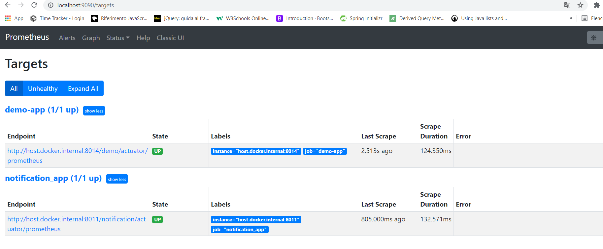
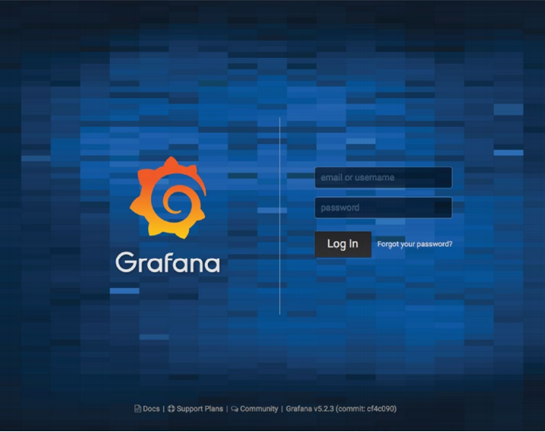
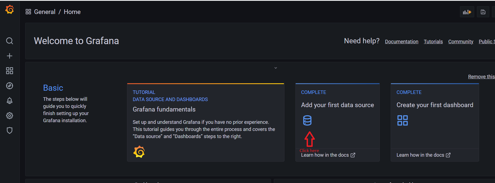
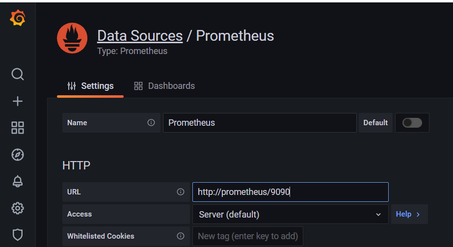
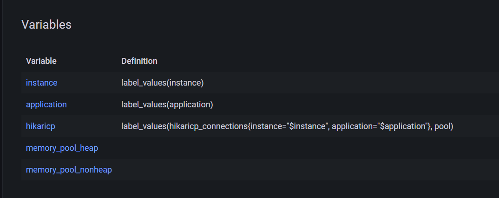
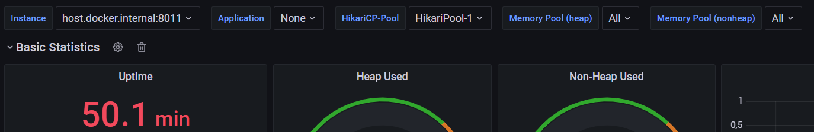

## PROMETHEUS AND GRAFANA

This autogenerated microservices application comes with a handy visualization tool build on Grafana that uses
Prometheus as its datasource for monitoring various state of the microservices application.
This function provide very useful monitoring data for every developer.

Spring boot actuator and micrometer are used to generate monitoring data that are then webscraped by Prometheus
and plotted by Grafana.

## Docker compose

To make use of such tools we have to run a docker container with instances of prometheus and grafana.
To do that open the resource explorer on the root folder , go into the "prometheus-grafana" folder and run the
command ** docker-compose up **.
After the container is up we have now the new following endpoints : 
  ---http://localhost:9090/targets show the Prometheus interface to monitor the state of the scraping at http://localhost:{port}/actuator/metrics of the particular application.
  ------ http://localhost:3030 which is the main page of Grafana.

## Prometheus 
This is a view of the targets endpoint of prometheus :

Nothing much to do here let's get to grafana set up!

## Grafana

This is a view of the main page of grafana :

You can use **admin/admin** as credentials and you can skip the procedure to reset the password.

Now in order to make Grafana take data from prometheus we have to create a DataSource.

Pick Prometheus as Data source and now simply write http://prometheus/9090 in the Url tab. Docker comes with a DNS so you can
either write localhost or prometheus.

## Grafana - Dashboard

After creating the data source is now time to create a dashboard as a visualization tool.

Click on the PLUS button and import next. You will be asked to upload a Json file that is the serialized representation of your dashboard.
Download the json from : 
-----https://grafana.com/api/dashboards/6756/revisions/2/download

** if the link doesn't work go to : --- https://grafana.com/grafana/dashboards/6756 and click download json in the lower right of the page. **

Now upload your json into Grafana and here you have your new dashboard! If you're lucky you will already see the data scraped from Prometheus and if that's not the case some additional steps are required but you are very close!

Go to the Dashboard settings

Go to the Variables section and put the following values 

After that you should be able to see the different values on the dropdown at the top of the dashboard page and your plots should start to take shape!

In this case we have a microservices application with multiple microservice on different ports which we can monitor by swapping the value of the "instance" variable.