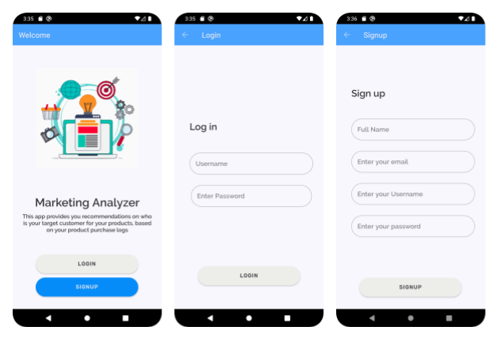

# System Overview
- It recommends target customers for products.
- The recommendation  gives data about target customer attributes of (Age – Education – Marital Status – Income – Having Kids – Purchase Method “In Store/Online”).
- The system needs from the client only purchase logs to run: “Customer X bought Y items of Z product”, The system needs to know any information about Customer X (point 2) and it’ll predict the rest.

The App is implemented to run on this Back-End: https://github.com/Ahmed-Tayel/Marketing-Analyzer

  
   

  
   

  
   

## HOW TO RUN:
1- Run the back-end system from: https://github.com/Ahmed-Tayel/Marketing-Analyzer

2- Open the Project with Android Studio

3- Run the emulator with "Pixel 5" Phone
