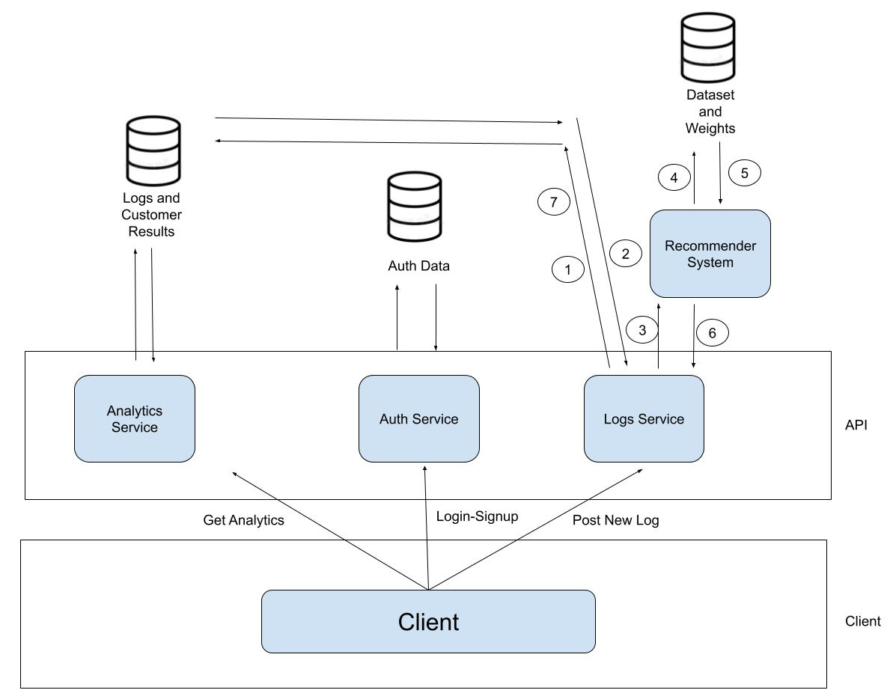
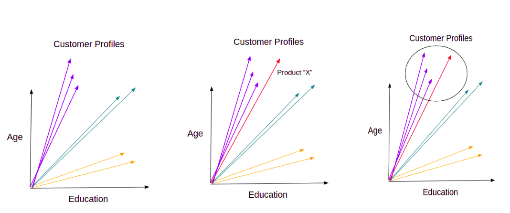

# System Overview
- It recommends target customers for products.
- The recommendation  gives data about target customer attributes of (Age – Education – Marital Status – Income – Having Kids – Purchase Method “In Store/Online”).
- The system needs from the client only purchase logs to run: “Customer X bought Y items of Z product”, The system needs to know any information about Customer X (point 2) and it’ll predict the rest.

  
   

## Recommender System
- It uses hybrid system of Content Based Recommendation and Collaborative Filtering Algorithm
- It creates customers profiles domain from a data-set, creates product profile from purchase logs, infer the product profile in the customers domain and retrieves the nearest “K” customers
- The results are the average of the “K” customers
- It used the dataset: https://www.kaggle.com/jackdaoud/marketing-data 
- Customer profile domain is per-configured in a database, the service fetches it only when it runs for the first time
- With every request the services only checks the data-set weights version in the database, if it’s not equal the one it has, it updates the data-set

  
   

## Logging Service
- Searches for the corresponding product profile in DB or creates new profile if not found
- Checks product profile last inference, if it is not recently updated, it invokes the recommender system
- Writes the log with the new/updated product profile in the database

## Authentication Service
- Sign-up/Log-in: it responds with a token to  the client to use it for all APIs
- The token should be included in the request header “Authorization” prefixed by “Bearer” and space as follows: {Authorization: Bearer "Token"}

## Analytics Service
- Provides the product owner with a ranking of products from the best selling to the worst selling products
- provides information about the most frequent customer together with the number of the products he purchased
- provides information about a given customer with the products he purchased the most/least

## HOW TO RUN:

Prerequisite: Docker/ Docker Compose/ nodeJS

1 - Create a database Cluster on MongoDB and update the database_uri in the environment file: Docker/vars.env 

2 - In Docker/vars.env: update "salt", "jwtSecret", "jwtAlgo" variables with your configurations

3 - In /Database_Dumper (One time Action):
$npm install
$npm start

4- In /Docker (Every-time to Run the System):
$docker-compose up --

5- Run the mobile app from the repo: https://github.com/Ahmed-Tayel/Android-App-Marketing-Analyzer