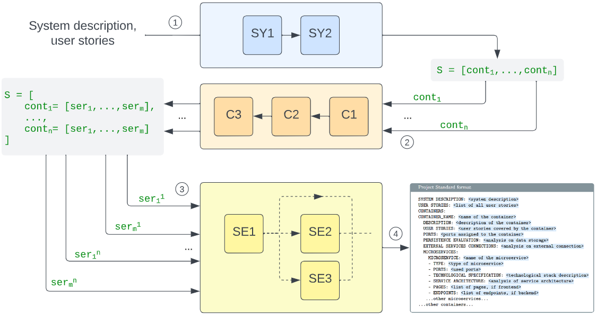
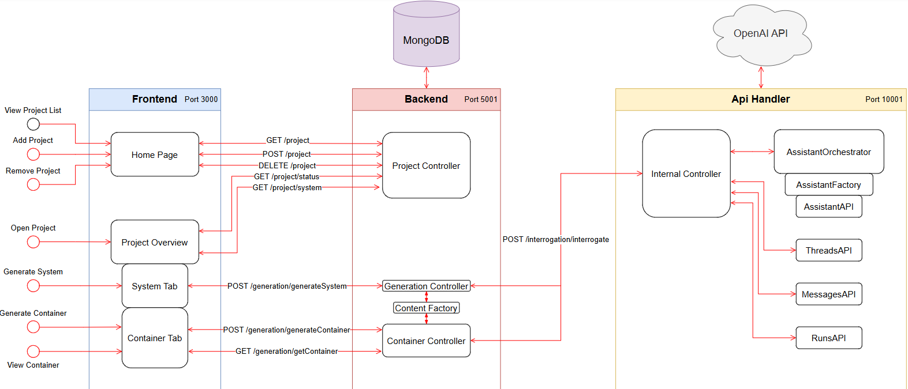

# ArchiGPT: an LLM-based solution for the generation of microservices architectures

This repository contains code for replicating the experiments in *"ArchiGPT: an LLM-based solution for the generation of microservices architectures"* paper.

## Prerequisites
- [Docker](https://www.docker.com)
- [OpenAI API Key](https://platform.openai.com)

## Setup
Create a `.env` file in the `ArchiGPT/src/api_handler` [directory](ArchiGPT/src/api_handler) and add the following line
```
OPENAI_API_KEY=<YOUR_OPENAI_API_KEY>
```

## Usage
- Run ArchiGPT:
    ```bash
    cd ArchiGPT/src
    docker compose up
    ```

- If the frontend service doesn't start:
    - Delete containers and images using:
        ```bash
        docker rm <CONTAINER_ID>
        docker rmi <IMAGE_ID>
        ```
    - Re-build and start the solution:
        ```bash
        cd ArchiGPT/src/frontend
        npm i
        cd ..
        docker compose up
        ```

- Frontend is available at `localhost:3000` and *mongo-express* is available at `localhost:8081`.\
*Mongo-express* credentials:
    ```
    user: admin
    password: pass
    ```

- You can download the Archi Dataset from this [link](https://zenodo.org/records/14238664). Use these projects to test the system.

- As an example, [generated_architectures](HumanEvaluation/generated_architectures) folder contains the generated architectures using GPT-4o.


## Demo of ArchiGPT


## Architecture


### Assistants prompt
Prompts of the employed assistants are available [here](ArchiGPT/src/api_handler/resources) (the prompts are divided by their employed phase, i.e., `System`, `Container` and `Service`).


## Infrastructure



## Evaluation
- Results of the automated evaluation of ArchiGPT are available [here](Metrics/src_metrics/be_node/src/data):
    - [GPT-4o-mini](Metrics/src_metrics/be_node/src/data/4o-mini-runs) contains the runs using GPT-4o-mini model.
    - [GPT-4o](Metrics/src_metrics/be_node/src/data/4o-runs) contains the runs using GPT-4o model.
    - [Students](Metrics/src_metrics/be_node/src/data/studentProjects) contains the runs of the students.
    
    Metrics are computed based on `data_metrics.json` in the [dataset](https://zenodo.org/records/14238664). An example of `data_metrics.json` is:
    ```
    [
        {
            "set_id": 1,
            "set_name": "auth client",
            "user_stories": [1, 2, 3, 4],
            "links": [2, 3, 5],
            "db": "true"
        },
        ...
        ]
    ```
    It consists of an array of dictionaries, each relative to a group (characterized by a `set_id` and a `set_name`) grouping user stories (identified by their numerical identifier in `user_stories`). Each dictionary also contains `links` and `db` fields to indicate other groups that have a related context and the need for a backend service to store or retrieve data. 

- [HumanEvaluation](HumanEvaluation) contains the sources of the human evaluation: the [questionnaire](HumanEvaluation/questionnaire.pdf) and the [results](HumanEvaluation/results.xlsx). The files used (ArchiGPT generated outputs) in the questionnaire are available in [docs](HumanEvaluation/docs) and [generated_architectures](HumanEvaluation/generated_architectures).


